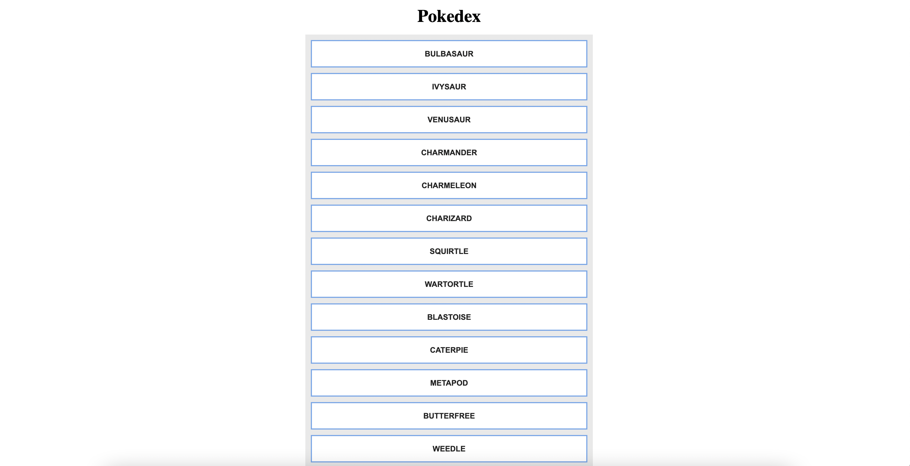

# Pokedex-app

> This web application is designed using HTML, CSS and JavaScript that loads data from an external API

## The app is designed in the following steps:

- Built a general outline of the app using JavaScript
- Accessed dataset for the application and displayed it in very basic way to the user using JavaScript
- Implemented a forEach loop to print details of each Pokémon in the app´s repository and updated forEach loops to work within the IIFE using JavaScript functions
- Rendered static data from the data repository on the page and added basic styling to the app (DOM interaction)
- Loaded data from external API via fetch and Promise using Ajax
- On click implemented modal popup which shows details fetched dynamically using Fetch and Promise

## Built With

- HTML5, CSS3, FlexBox, JavaScript
- Fetch, Promise and Ajax

[Live Demo Link](https://niketshukla.github.io/js-app/)
